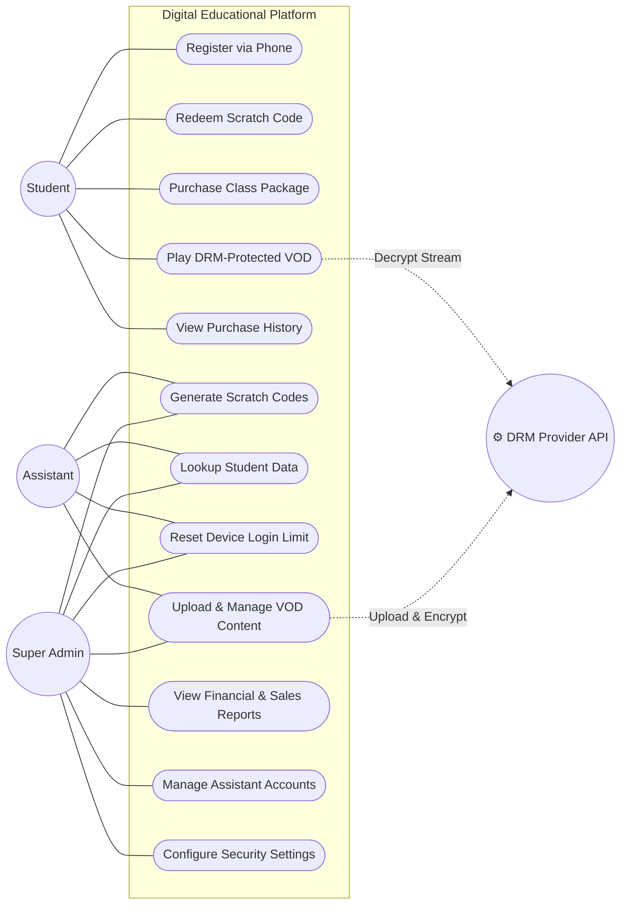

```mermaid
flowchart LR
    %% الممثلين البشريين (Human Actors)
    Student((Student))
    Assistant((Assistant))
    Teacher((Super Admin))

    %% الأنظمة الخارجية (External APIs)
    DRM((⚙️ DRM Provider API))

    %% حدود النظام (System Boundary)
    subgraph Platform [Digital Educational Platform]
        direction TB
        %% وظائف الطالب
        UC1([Register via Phone])
        UC2([Redeem Scratch Code])
        UC3([Purchase Class Package])
        UC4([Play DRM-Protected VOD])
        UC11([View Purchase History])
        
        %% وظائف التشغيل (للمساعد والمدرس)
        UC5([Generate Scratch Codes])
        UC6([Lookup Student Data])
        UC7([Reset Device Login Limit])
        UC9([Upload & Manage VOD Content])

        %% وظائف الإدارة العليا (للمدرس فقط)
        UC8([View Financial & Sales Reports])
        UC10([Manage Assistant Accounts])
        UC12([Configure Security Settings])
    end

    %% ربط الطالب
    Student --- UC1
    Student --- UC2
    Student --- UC3
    Student --- UC4
    Student --- UC11

    %% ربط المساعد (المهام التشغيلية)
    Assistant --- UC5
    Assistant --- UC6
    Assistant --- UC7
    Assistant --- UC9

    %% ربط المدرس (جميع المهام التشغيلية + الإدارة العليا)
    Teacher --- UC5
    Teacher --- UC6
    Teacher --- UC7
    Teacher --- UC9
    Teacher --- UC8
    Teacher --- UC10
    Teacher --- UC12

    %% ربط الأنظمة الخارجية (Technical Dependencies)
    UC4 -.->|Decrypt Stream| DRM
    UC9 -.->|Upload & Encrypt| DRM
```
